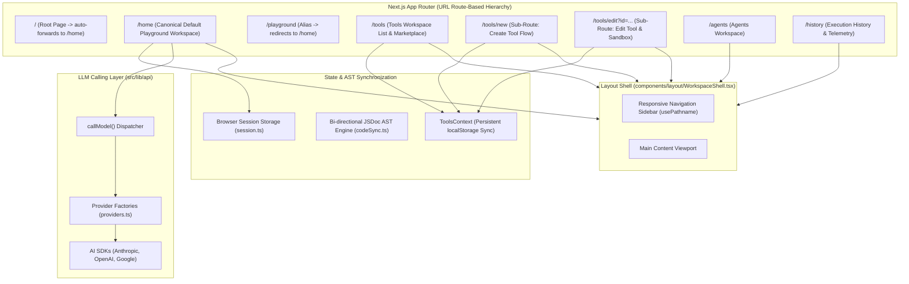

# Loom — Technical Architecture & Route Hierarchy Documentation

This document provides a comprehensive technical overview and module-by-module reference for the **Loom** codebase.

---

## 1. High-Level Architecture & Route Hierarchy

---

## 2. Route Manifest & Navigation Behavior

| URL Route | View Component | Description | Back Navigation Behavior |
| :--- | :--- | :--- | :--- |
| `/` | `app/page.tsx` | Root landing route | Forwards immediately to `/home` |
| `/home` | `app/home/page.tsx` | Default Playground workbench | Preserves browser history |
| `/playground` | `app/playground/page.tsx` | Alias for playground | Forwards immediately to `/home` |
| `/tools` | `app/tools/page.tsx` | Tools list, search, and marketplace | Back button returns to `/home` |
| `/tools/new` | `app/tools/new/page.tsx` | Tool creation wizard (Choose -> Editor / Service) | Back button returns to `/tools` |
| `/tools/edit?id=...` | `app/tools/edit/page.tsx` | Inspect and edit existing tool in live sandbox | Back button returns to `/tools` |
| `/agents` | `app/agents/page.tsx` | Automated multi-agent workflow systems | Back button returns to previous page |
| `/history` | `app/history/page.tsx` | Run audit log and latency/token telemetry | Back button returns to previous page |

---

## 3. Directory Structure & Module Manifest

| Path | Purpose | Key Exports |
| :--- | :--- | :--- |
| [`components/layout/WorkspaceShell.tsx`](file:///d:/BubbleIndexOne/Agent-Playground/components/layout/WorkspaceShell.tsx) | Common layout wrapper with active route detection | `WorkspaceShell`, `Sidebar`, `Logo` |
| [`components/playground/PlaygroundScreen.tsx`](file:///d:/BubbleIndexOne/Agent-Playground/components/playground/PlaygroundScreen.tsx) | Interactive prompt template and model tuning workbench | `PlaygroundScreen` |
| [`components/tools/ToolsContext.tsx`](file:///d:/BubbleIndexOne/Agent-Playground/components/tools/ToolsContext.tsx) | Context provider for persistent tool state across routes | `ToolsProvider`, `useTools` |
| [`components/tools/ToolsScreen.tsx`](file:///d:/BubbleIndexOne/Agent-Playground/components/tools/ToolsScreen.tsx) | Tools workspace list, search, and filters | `ToolsScreen` |
| [`components/agents/AgentsScreen.tsx`](file:///d:/BubbleIndexOne/Agent-Playground/components/agents/AgentsScreen.tsx) | Automated multi-agent workflow manager | `AgentsScreen` |
| [`components/history/HistoryScreen.tsx`](file:///d:/BubbleIndexOne/Agent-Playground/components/history/HistoryScreen.tsx) | Session prompt audit log and telemetry viewer | `HistoryScreen` |
| [`src/lib/constants.ts`](file:///d:/BubbleIndexOne/Agent-Playground/src/lib/constants.ts) | Centralized system constants and defaults | `STORAGE_KEYS`, `DEFAULT_MODEL_CONFIGS`, `REASONING_LEVELS`, `TOOL_CHOICES` |
| [`src/lib/api/types.ts`](file:///d:/BubbleIndexOne/Agent-Playground/src/lib/api/types.ts) | TypeScript interfaces for model configs and results | `Model`, `Provider`, `ModelConfig`, `CallResult` |
| [`src/lib/api/session.ts`](file:///d:/BubbleIndexOne/Agent-Playground/src/lib/api/session.ts) | Session storage credential & config management | `saveKey()`, `getKey()`, `clearKey()`, `saveModelConfigs()`, `getModelConfigs()` |
| [`src/lib/api/providers.ts`](file:///d:/BubbleIndexOne/Agent-Playground/src/lib/api/providers.ts) | AI SDK client initialization factories | `providerFactories` (Anthropic, OpenAI, Google) |
| [`src/lib/api/index.ts`](file:///d:/BubbleIndexOne/Agent-Playground/src/lib/api/index.ts) | Unified model execution facade | `getProviders()`, `callModel()` |
| [`src/index.ts`](file:///d:/BubbleIndexOne/Agent-Playground/src/index.ts) | Cloudflare Worker edge entrypoint | `fetch(request, env)` |
| [`lib/utils.ts`](file:///d:/BubbleIndexOne/Agent-Playground/lib/utils.ts) | Tailwind CSS class merging helper | `cn(...inputs)` |
| [`components/ui/button.tsx`](file:///d:/BubbleIndexOne/Agent-Playground/components/ui/button.tsx) | Accessible CVA button primitive | `Button`, `buttonVariants` |

---

## 4. Core Subsystems

### 4.1 Hierarchical Routing & Browser History
- **Router-based navigation**: Instead of an in-memory `useState('Playground')`, every primary section is a canonical URL route. Clicking between `/home`, `/tools`, `/agents`, and `/history` creates history entries via `next/link`.
- **Sub-Route Navigation**: Drilling down into `/tools/new` or `/tools/edit?id=...` creates distinct history entries. Pressing the browser's native **Back** button or the UI back button pops the history stack back to `/tools` instead of kicking the user out of the app.
- **Persistent State**: The `ToolsContext` synchronizes tools to `localStorage` so that changes made in `/tools/new` or `/tools/edit?id=...` immediately reflect upon returning to `/tools` and survive browser page reloads.

### 4.2 LLM Invocation Subsystem (`src/lib/api`)
- Multi-provider support for Anthropic Claude, OpenAI GPT, and Google Gemini via Vercel AI SDK (`ai`).
- Direct client execution with Bring-Your-Own-Key (BYOK) architecture stored strictly in `sessionStorage`.
- Fine-grained hyper-parameter tuning (temperature, stop sequences, max tokens, top-P, top-K, presence/frequency penalties, and seed).

### 4.3 Live Sandboxed Execution Engine (`LiveTestSandbox.tsx`)
- In-browser code runner using dynamic `AsyncFunction`.
- Sandbox capability enforcers:
  - Network permission gating (`capabilities.network`).
  - Local storage permission gating (`capabilities.storage`).
  - Environment variable gating (`capabilities.environment`).
- Virtualized console logging and safety execution timeout (8000ms).

---

## 5. Deployment Architecture
- **Next.js Static Export**: Compiled via `output: 'export'` in [`next.config.mjs`](file:///d:/BubbleIndexOne/Agent-Playground/next.config.mjs) to static HTML/JS/CSS assets in `./out`.
- **Cloudflare Workers**: Configured in [`wrangler.toml`](file:///d:/BubbleIndexOne/Agent-Playground/wrangler.toml) with edge asset routing handled by [`src/index.ts`](file:///d:/BubbleIndexOne/Agent-Playground/src/index.ts).
